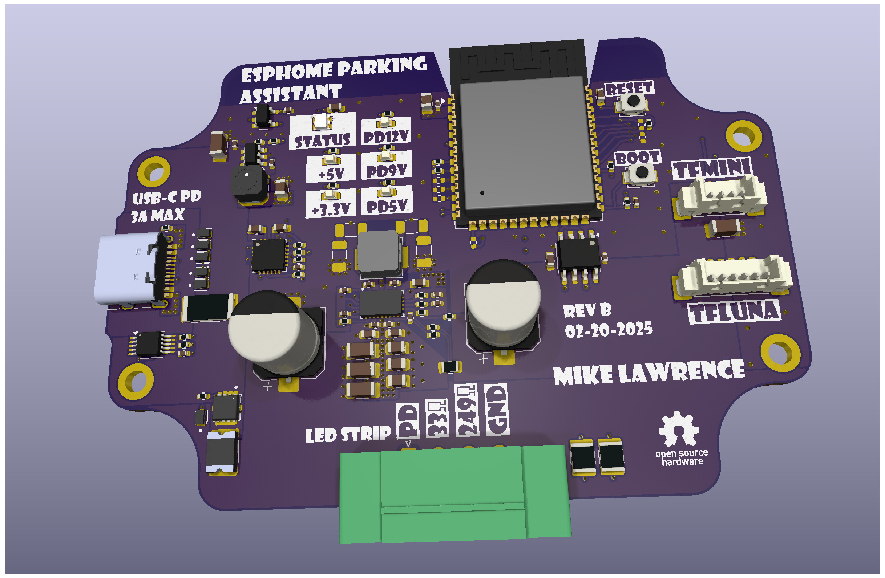
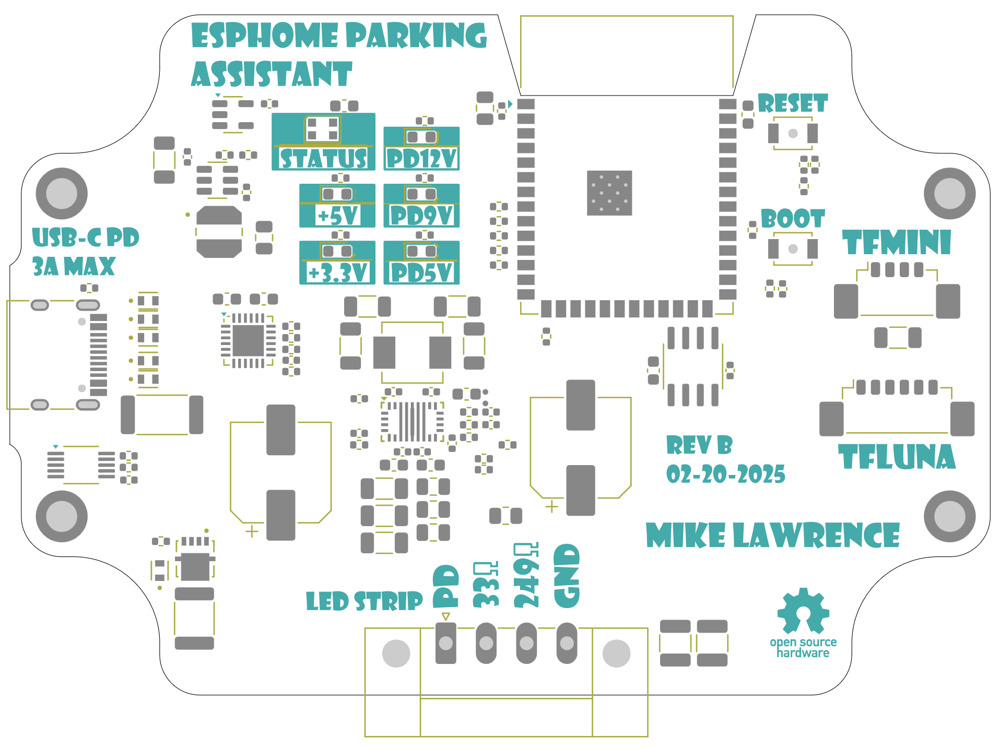

# ESPHome-Parking-Assistant PCB

      
    3D Render of ESPHome Parking Assistant PCB

The PCB is designed in [KiCad](https://www.kicad.org/). Fabrication and Assembly is tuned toward [JCLPCB](https://jlcpcb.com/). The production folder has everything you need for JLCPCB to send you fully assembled boards.

## Bill of Materials

      
    Interactive BOM

## PCB Info
* 4 layer to support an additional ground plane and signal layer to reduce plane interruptions on the outer layers.
* Dimension are 85mm X 59mm.
* Requires oven reflow or hot air to assemble some components.

