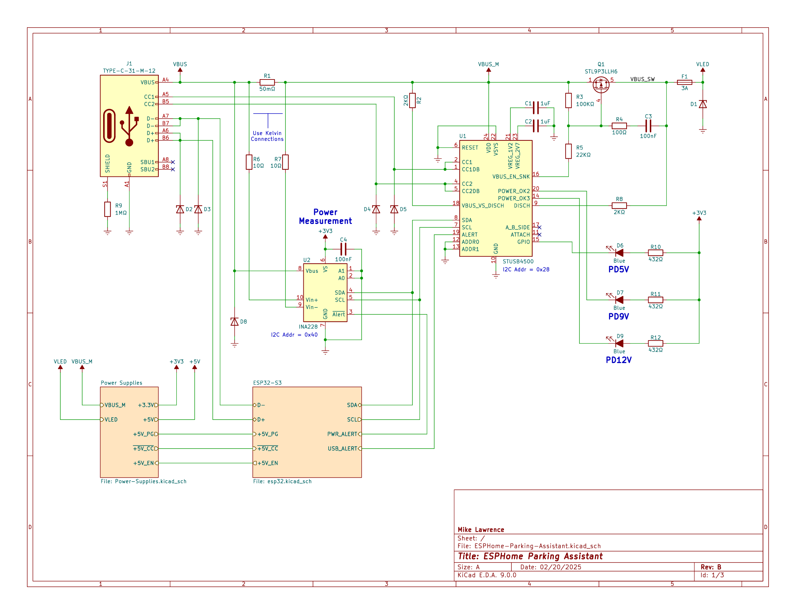

# ESPHome Parking Assistant PCB
<p align="center">
     <br />
    3D Render of ESPHome Parking Assistant PCB
</p>

The PCB is designed in [KiCad](https://www.kicad.org/). Fabrication and Assembly is tuned toward [JCLPCB](https://jlcpcb.com/). The production folder has everything you need for JLCPCB to send you fully assembled boards.

## Schematic
<p align="center">
    <a href="ESPHome-Parking-Assistant-Schematic.pdf"></a> <br />
    Schematic
</p>

### Do Not Populate (DNP) Notes
* ```C9```, ```C10```, ```R16``` and ```R17```: These components are an optional snubber used to reduce EMI.
* ```R31``` and ```R32``` are pullups for open drain outputs. If these pins are used the 10K pullup will be enabled on the ESP32 input pins.
* ```R33``` and ```R35``` are pullups for the I<sub>2</sub>C Bus. By default the internal ESP32 pullups are enabled.
* ```R34``` and ```R36``` can be used to pullup or pulldown the ```CONFIG``` pin on the TFLuna connector. For now this is not necessary because the code only support the UART interface on the TFLuna and leaving ```CONFIG``` floating will enable the UART. 
* ```R26``` is used to compensate for cable droop. Not currently used.

## Bill of Materials
<p align="center">
    <a href="https://htmlpreview.github.io/?https://github.com/mikelawrence/ESPHome-Parking-Assistant/blob/main/pcb/interactive-bom/index.html"></a> <br />
    Interactive BOM
</p>

## PCB Info
* 4 layer to support an additional ground plane and signal layer to reduce plane interruptions on the outer layers.
* Dimension are 85mm X 59mm.
* Requires oven reflow or hot air to assemble some components.
* Supports TFMini Plus, TFMini-S and TFLuna Range Finder Sensors. Enclosure is designed for TFMini Plus Sensor.

